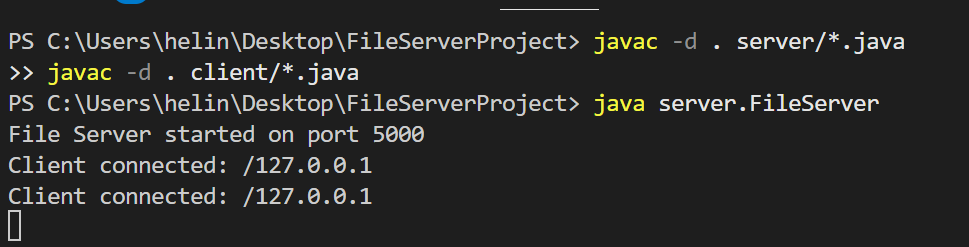
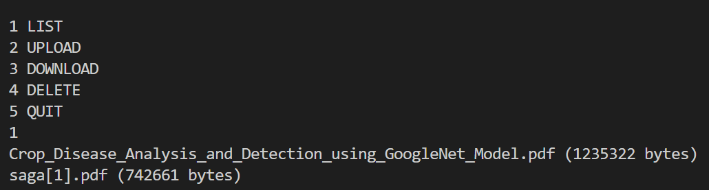
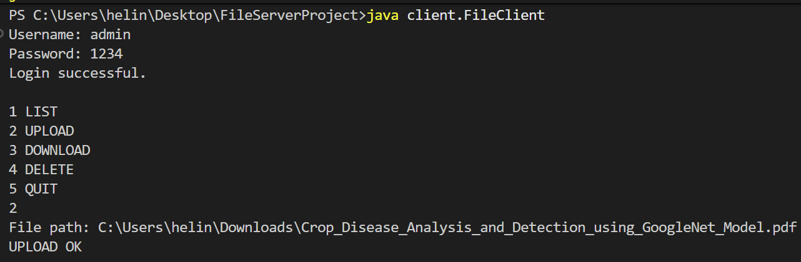
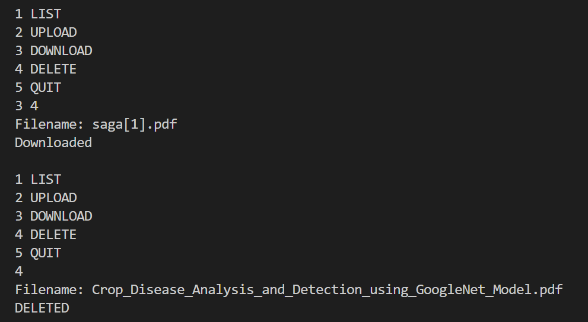
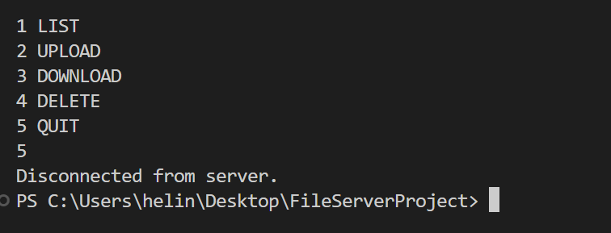

# Multithreaded File Server

A concurrent TCP file server built in Java that supports multiple clients performing file operations simultaneously.

## Features

* Multithreaded server using `ExecutorService`
* TCP socket communication
* User authentication
* File upload
* File download
* File deletion
* Directory listing with file sizes
* Persistent client sessions
* Thread-safe file operations

## Project Structure

```
FileServerProject
├── client
│   └── FileClient.java
├── server
│   ├── FileServer.java
│   └── ClientHandler.java
└── storage
```

## How It Works

1. The server listens on port **5000**
2. Clients connect and authenticate
3. Clients can send commands:

```
LIST
UPLOAD
DOWNLOAD
DELETE
QUIT
```

4. The server handles multiple clients using a **thread pool**

## How to Run

Compile:

```
javac -d . server/*.java
javac -d . client/*.java
```

Run Server:

```
java server.FileServer
```

Run Client:

```
java client.FileClient
```

## Example Commands

```
1 LIST
2 UPLOAD
3 DOWNLOAD
4 DELETE
5 QUIT
```
## Screenshots

### Server Started


### List Files


### File Upload


### File Download and Delete


### Client Disconnect / Quit

## Technologies Used

* Java
* TCP Sockets
* Multithreading
* ExecutorService
* File I/O

## Learning Outcomes

* Client-server architecture
* Concurrency using thread pools
* Thread-safe file operations
* Network protocol design
* Buffered file transfer

  ## Author
  Helinia sarah
